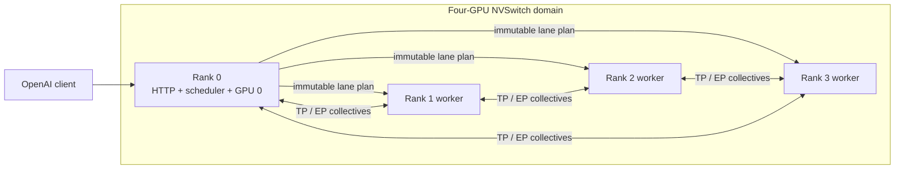

# Infer: a minimal high-performance inference server

Status: current design; source layout updated 2026-09-03

This document describes the current runtime. Acceptance gates live in
[acceptance.md](acceptance.md). The source
layout and ownership boundaries below match the implementation, while performance and quality claims remain contingent on the B200 validation gates. The 4xB200 feasibility check is recorded in [feasibility.md](feasibility.md).

## Decision summary

Infer is a single-node, single-model server for `deepseek-ai/DeepSeek-V4-Flash-0731` and `zai-org/GLM-5.3-Flash` on four NVIDIA B200-class GPUs. It exposes a small OpenAI-compatible text API and deliberately does not try to become a general inference framework.

The runtime has one authoritative scheduler, one worker per GPU, two explicit model implementations, and one concrete set of operations per model. Thin interfaces name stable boundaries such as model execution, prompt encoding, and state layout; model internals stay direct and top-down. The scheduler continuously batches work and manages model-declared state; workers only execute immutable batch plans. There is no model compiler, runtime backend registry, distributed scheduler, or multi-level transformer inheritance hierarchy.

The minimum performance set is:

- iteration-level continuous batching with bounded chunked prefill;
- heterogeneous paged history plus fixed per-sequence state;
- HBM prefix reuse with model-state snapshots;
- static expert parallelism with either attention data parallelism or tensor parallelism;
- one-step CPU/GPU scheduling overlap;
- decode CUDA graphs and GPU-side sampling;
- the checkpoint's native DSpark or MTP speculator when its final build wins end to end;
- one pinned, model-native kernel path for attention, MoE, and recurrent state.

Everything else requires end-to-end profiling evidence before it enters the design.

## Scope and assumptions

### In scope

- One model per server and one four-GPU process group.
- Four 180 GB B200 SXM GPUs in one healthy NVSwitch domain. NVIDIA documents 180 GB HBM3e and up to 8 TB/s memory bandwidth per B200, while fifth-generation NVLink provides up to 1.8 TB/s bidirectional bandwidth per GPU ([HGX component table](https://docs.nvidia.com/enterprise-reference-architectures/hgx-ai-factory/latest/components.html), [Blackwell tuning guide](https://docs.nvidia.com/cuda/blackwell-tuning-guide/)).
- Linux, CUDA SM100, PyTorch, NCCL, and model-native CUDA/Triton kernels.
- Streaming chat and raw text completion, including reasoning and tool-call formatting.
- Greedy, temperature, top-p, OpenAI stop strings, and `n=1` sampling.
- Contexts up to the checkpoint limit when the state memory plan admits them.
- Correct loading of the checkpoints' native mixed precision. Infer never quantizes weights at startup.

### Explicit assumptions

- “SOTA” means a measured latency/goodput Pareto frontier on the same four GPUs, checkpoint revision, precision, request trace, and quality settings. It is an acceptance criterion, not a claim made by this document.
- “Similar hardware” means an SM100-compatible target with sufficient HBM and full peer access. A PCIe-only four-GPU machine is a different performance target.
- V1 is text-only. GLM-5.3-Flash contains a vision encoder, but image/video preprocessing and serving are a separate vertical feature and are not part of the V1 SOTA claim.
- The deployment owns the whole node. Authentication, TLS, rate limiting, and autoscaling belong in an upstream gateway.

### Out of scope for V1

- Multiple models, hot reload, LoRA, adapters, embeddings, reranking, beam search, grammar-constrained decoding, and prompt logprobs.
- Multi-node serving, pipeline/context parallelism, prefill/decode disaggregation, and fault-tolerant collectives.
- Host or NVMe state offload, a second-level cache, and remote prefix transfer.
- Runtime quantization choices or a matrix of interchangeable kernels.
- Dynamic expert placement, online autotuning, or compilation on the request path.
- GLM image and video input.

## Target checkpoints

Both targets exist publicly. Their revisions must be pinned because their repositories and serving support are moving quickly.

| Model | Pinned revision | Inference-relevant shape |
| --- | --- | --- |
| DeepSeek-V4-Flash-0731 | [`7872f01`](https://huggingface.co/deepseek-ai/DeepSeek-V4-Flash-0731/tree/7872f01b1d1fe23eabc4c98b48bffcef5a386062) | 43 layers, hidden size 4096, 1,048,576-token context; 256 routed experts, top-6, one shared expert; native MXFP4 routed experts with mixed FP8/BF16 state; two initial sliding-window layers followed by alternating 4:1 CSA and 128:1 HCA; attached DSpark module. See the pinned [config](https://huggingface.co/deepseek-ai/DeepSeek-V4-Flash-0731/blob/7872f01b1d1fe23eabc4c98b48bffcef5a386062/config.json), [reference inference code](https://huggingface.co/deepseek-ai/DeepSeek-V4-Flash-0731/tree/7872f01b1d1fe23eabc4c98b48bffcef5a386062/inference), and [technical report](https://arxiv.org/html/2606.19348). |
| GLM-5.3-Flash | [`04c4e9e`](https://huggingface.co/zai-org/GLM-5.3-Flash/tree/04c4e9e95c5da8862dced7e5056455116f83a7e0) | 45 layers, hidden size 4096, 1,048,576-token context; 34 KDA recurrent-attention layers and 11 sparse MLA layers; first three FFNs dense, then 288 routed experts, top-8, and one shared expert; mixed BF16/block-FP8 weights; one native NextN/MTP layer. See the pinned [model card](https://huggingface.co/zai-org/GLM-5.3-Flash/blob/04c4e9e95c5da8862dced7e5056455116f83a7e0/README.md), [config](https://huggingface.co/zai-org/GLM-5.3-Flash/blob/04c4e9e95c5da8862dced7e5056455116f83a7e0/config.json), and [chat template](https://huggingface.co/zai-org/GLM-5.3-Flash/blob/04c4e9e95c5da8862dced7e5056455116f83a7e0/chat_template.jinja). |

These are not ordinary homogeneous-attention transformers:

- DeepSeek V4 has persistent compressed history, a rolling 128-token window, and unfinished Compressor/Indexer state. A prefix hit must restore all of them, not only attention KV. NVIDIA's model-specific implementation reaches the same conclusion ([cache design](https://github.com/NVIDIA/TensorRT-LLM/blob/main/docs/source/blogs/tech_blog/blog26_DeepSeek_V4_on_NVIDIA_Blackwell_Model_Specific_and_Agentic_Workload_Optimizations_in_TensorRT-LLM.md#cache-management-and-runtime-features)).
- GLM's KDA layers have recurrent and short-convolution state whose size is per live sequence rather than per retained token. Its sparse MLA layers separately retain token-indexed history. The pinned Transformers implementation makes this split visible in [`modeling_glm5_next.py`](https://github.com/huggingface/transformers/blob/83d024e1bfed0d425d20bcde2b46a56b2333906e/src/transformers/models/glm5_next/modeling_glm5_next.py).

A single `KVCache` abstraction would give the scheduler incorrect capacity and lifetime information.

## Design principles

The design distills, rather than copies, the reference servers:

- [nano-vLLM](https://github.com/GeeeekExplorer/nano-vllm/tree/bb823b3e06983d71485a8e1f23715ebd87d98ef8): keep the engine step visibly `schedule -> execute -> commit`, derive state capacity after loading/warmup, and use chained whole-block hashes with refcounted pages.
- [mini-SGLang](https://github.com/sgl-project/mini-sglang/tree/9a91cfafe754aa85daee49998176275667eb58f2): use a small request/batch vocabulary, overlap one CPU scheduling step with GPU execution, use phase-specific kernels, and capture decode graph buckets.
- [TokenSpeed](https://github.com/lightseekorg/tokenspeed/tree/f17b03efc1728875c586d848f49da5905032e87c): make dispatch and commit explicit, separate logical token accounting from physical state layout, and treat recurrent/compressed state as first-class. Do not copy its placement compiler, cache tiers, plugin system, or full scheduler FSM.

Rules for keeping this true over time:

1. Add a thin abstraction when it names a stable ownership or semantic boundary, isolates a third-party API, or has a second real use. Do not add inheritance, registration, or configuration machinery for anticipated variants.
2. Model-specific behavior stays in the model or its ops bundle; generic code handles ownership and scheduling only.
3. There is one source of truth for every derived value. `StateLayout` produces both scheduler accounting and kernel views.
4. A new optimization must improve a named end-to-end frontier point or enable required correctness/capacity. A kernel-only win is insufficient.
5. When a new path wins, remove the losing production path. Reference implementations may remain under tests, not behind runtime switches.

## Architecture



There are four rank processes:

1. Rank 0 owns HTTP, request validation, tokenization, incremental detokenization, SSE streams, the only scheduler, and the host-side state/cache index. HTTP runs on a dedicated thread while the main thread drives GPU work.
2. Ranks 1-3 are intentionally dumb worker processes. They receive plans and execute the same collective sequence as rank 0.

The launcher uses the multiprocessing `spawn` method, creates bounded local pipes before CUDA initialization, and then initializes one NCCL group. Messages use a fixed binary schema through `send_bytes`; no per-step Python object pickling or network RPC framework is needed. Full block tables and token buffers remain resident on each GPU, so plans carry slot IDs and table deltas rather than complete sequence state.

Rank 0 keeps an entry-bounded host LRU of token IDs keyed by SHA-256 digests of validated message JSON. It holds at most 64 entries and bypasses entries longer than 16,384 tokens. It memoizes only complete tokenization; it neither extends a message prefix nor owns model state. This small frontend cache avoids re-tokenizing identical long prompts before an HBM prefix hit and is not a model-state offload tier.

Rank 0 scheduling avoids a failure mode in which four independently scheduled ranks make different ordering or allocation decisions and then enter incompatible collectives. mini-SGLang recently needed an explicit request-order fix for this class of issue ([commit](https://github.com/sgl-project/mini-sglang/commit/9a91cfafe754aa85daee49998176275667eb58f2)).

### Source layout

```text
src/infer/
  cli.py             model selection and the public command-line surface
  api.py             OpenAI request and response translation
  http.py            HTTP, SSE, validation, and cancellation
  codec.py           shared codec contracts and tokenization cache
  protocol.py        Request, BatchPlan, StepResult binary schemas
  engine.py          dispatch/commit loop and process lifecycle
  service.py         request lifecycle above the engine protocol
  scheduler.py       batching and admission policy
  state.py           arenas, leases, prefix index, memory plan
  runtime.py         fixed four-rank process and B200 runtime support
  models/
    deepseek_v4_flash/
      model.py       model constants, records, weight and state layouts
      checkpoint.py  pinned checkpoint loading
      codec.py       prompt encoding and incremental decoding
      target.py      target model and runtime allocation
      dspark.py      native speculative model and runtime allocation
      worker.py      rank-local batch execution and CUDA graphs
      serve.py       model-specific serving composition
      launch.py      process-launch entrypoint
      ops/           private SM100 CUDA and Triton operations
    glm53_flash/
      model.py       model constants, records, and state/workspace layouts
      checkpoint.py  pinned checkpoint inventory and loading
      codec.py       prompt encoding and incremental decoding
      target.py      target model and runtime allocation
      nextn.py       native speculative model and runtime allocation
      worker.py      rank-local batch execution and CUDA graphs
      serve.py       model-specific serving composition
      launch.py      process-launch entrypoint
      ops/           private SM100 CUDA and Triton operations
```

Small protocols live beside the component that consumes them instead of forming a `base.py` inheritance tree or plugin system. There is no generic model builder or runtime backend registry. The CLI selects explicitly between the two supported model packages.

## Core contracts

Only four data records cross component boundaries:

| Record | Owner and purpose |
| --- | --- |
| `Request` | Scheduler-owned host state: token IDs, sampling parameters, committed length, output IDs, lane, cancellation, and state leases. Scheduling phase is derived from committed progress plus ordered outstanding prompt spans; it is not separately mutable. |
| `BatchPlan` | Immutable plan with a monotonic step ID and one sub-plan per attention lane: request slots, token ranges, immutable output/model caps, table deltas, sampling rows, and ordered worst-case append reservations. |
| `StepResult` | Compact observations only: accepted token IDs/counts, finish flags, error status, and timings. It never transfers state ownership. |
| `StateLayout` | Immutable, model-produced description of history blocks, fixed sequence state, workspace, dtypes, byte offsets, retention, and kernel-page views. It is a startup schema, not a container for request state. |

The long-lived owners are equally small:

- `Scheduler` decides what runs and is the only host-side mutator of request/state ownership.
- `StateManager` admits, leases, snapshots, shares, evicts, and frees opaque model state.
- `Worker` turns a `BatchPlan` into a `StepResult`.
- Each explicit model class performs weight loading and top-down forward execution using its matching ops bundle.

## Request lifecycle

1. The API validates the request and uses the selected model's codec to produce token IDs. DeepSeek uses the checkpoint's dedicated [`encoding/`](https://huggingface.co/deepseek-ai/DeepSeek-V4-Flash-0731/tree/7872f01b1d1fe23eabc4c98b48bffcef5a386062/encoding) implementation rather than inventing a Jinja template. GLM compiles its pinned Jinja template once at startup.
2. Rank 0 checks the model-length limit, probes the prefix index, chooses a DEP lane when applicable, and queues the request.
3. Admission atomically acquires one mutable sequence-state slot, references any reusable history blocks, restores a compatible state snapshot, and allocates enough history for the next scheduled chunk. Snapshot-cache capacity is best-effort and does not gate admission.
4. Prefill may span multiple bounded chunks. Device commit selects the state at the accepted length; host commit advances ownership through the accepted prefix of the plan's ordered reservations and frees the unused suffix.
5. Decode runs one target step or one native speculative draft/verify step per scheduling iteration. Sampling and model EOS checks happen on GPU without exposing rejected-token state.
6. The rank 0 driver publishes accepted token IDs to its HTTP thread. The codec incrementally detokenizes, matches stop strings, and parses reasoning/tool-call boundaries before SSE delivery.
7. After the plan that captures the last complete input-prompt boundary host-commits, rank 0 may publish that prompt endpoint. Decode state from the current response is never published in V1.
8. Completion or cancellation becomes final after every dispatched plan referencing the request commits. Rank 0 then releases active state; accepted token IDs already copied to the bounded API queue remain independent of GPU lifetime.

Any worker failure terminates the process group. V1 does not attempt partial NCCL recovery or state reconstruction after a rank dies.

## Scheduler

### Policy

The scheduler is FIFO within a lane and iteration-level work-conserving within the selected step kind:

1. Commit the oldest completed step.
2. Ingest new requests and cancellations.
3. Retire terminal requests whose final lease has committed.
4. Choose a graph-decode or eager-service step.
5. A graph-decode step schedules only ready decodes in least-recently-served order and reserves the model's maximum draft width.
6. An eager-service step reserves one complete bounded prefill chunk per ready lane, schedules ready decodes in the remaining token and row capacity, then materializes the reserved resumed or new prefills.
7. Balance scheduled token work across DEP lanes while respecting prefix affinity, then dispatch one immutable plan.

If both phases remain ready, a checked-in recipe permits at most `max_decode_ticks_between_prefills` graph-decode steps before one eager-service step. Reserving a complete prefill chunk prevents ready decodes from fragmenting bulk prefill into inefficient tails; the eager step includes decodes whenever capacity remains. The bounded cadence limits decode stalls without allowing a continuous trickle of prefills to disable decode graphs. With only prefills, every step is eager; with only decodes, every supported bucket is graphed.

The decode-tick cadence bounds the inter-token-latency cost of a full prefill chunk. Prefill remains chunked and batchable; it is not forced to run one request at a time. The profile supplies one maximum step-token budget, one maximum prefill chunk, and the decode-tick cadence. The initial DeepSeek recipe starts from the checkpoint's published 4096-token chunk recommendation, then changes only through benchmarked recipe revisions ([model card](https://huggingface.co/deepseek-ai/DeepSeek-V4-Flash-0731/blob/7872f01b1d1fe23eabc4c98b48bffcef5a386062/README.md)).

Admission checks both independent resources:

- history-block capacity for token-indexed state;
- reserved live-slot capacity for rolling or recurrent state.

It also reserves the worst-case append for every request in each dispatched plan. A request may appear in two outstanding plans, so capacity accounting includes both leases. Snapshot slots come from a separate best-effort quota and cannot consume the live-slot reserve. Cached blocks and snapshots are evicted before a running request is preempted.

### One-step overlap

While GPU step `N` runs, the control thread commits `N-1` and prepares `N+1`. Dispatch of `N+1` is barred until host commit of `N-1` finishes, but it does not wait for `N`; it queues behind `N` on the worker stream and consumes the device length and active flag produced by `N`. Two pinned descriptor buffers alternate. Sampled IDs, accepted lengths, token storage, and execution tables stay on GPU.

Host request lengths may therefore lag the device by one step. The invariants are:

- at most two plans are dispatched: one executing or complete-but-uncommitted plan and one queued or executing successor;
- both dispatched plans retain leases on every referenced page, slot, and append reservation until their host commits;
- a device commit kernel clamps acceptance to the remaining `max_tokens` and model-length budgets, promotes only state at that accepted length, updates device length, and clears the active flag on EOS or exhausted budget before the successor can execute;
- a cancellation observed before dispatch clears the device active flag; if it arrives after a successor was dispatched, that row may execute but its output is discarded, no later row is dispatched, and its lease still commits normally;
- only host `commit()` advances host-visible lengths, commits the accepted prefix of ordered reservations, or releases the unused suffix;
- completion and free are idempotent.

Draft and target kernels may write reserved history and model-owned candidate state, never the authoritative live state in a way that exposes rejected tokens. Each concrete ops bundle implements `commit_accepted(accept_count)`, using whatever exact shadow state, sufficient projections, or accepted-prefix replay its model requires. The call materializes the result into the request's canonical live slot, updates length/tables, and records completion behind an event; slot addresses and ownership never change on device. The generic runtime neither names nor configures the mechanism.

`StateLayout` reports `transaction_workspace_bytes(draft_width)` for that implementation. Startup reserves the maximum graph bucket's workspace at fixed addresses and fails the M0 feasibility gate if it does not fit. The transaction harness exercises every accept count across KDA recurrence, Compressor/Indexer partials, rolling windows, history-table boundaries, and native draft state. Inferred rollback from a token count is forbidden.

This is the useful part of mini-SGLang and TokenSpeed overlap scheduling without a general pipeline engine. In particular, pinned staging memory has per-step lifetime and is never reused until its copy event completes ([TokenSpeed warning](https://github.com/lightseekorg/tokenspeed/blob/f17b03efc1728875c586d848f49da5905032e87c/docs/serving/parallelism.md#runtime-notes)).

### Pressure and preemption

Normal admission leaves a decode watermark and stops admitting prefills before active decodes are at risk. If long-running requests still consume all history capacity:

1. Evict unreferenced prefix entries.
2. Stop admitting new requests and enter drain mode.
3. If the next decode step still cannot be reserved, select the most recently admitted request with useful *releasable* bytes, excluding shared pages and outstanding leases. Stop dispatching it and wait for its dispatched plans to commit.
4. Atomically remove its private snapshot candidate and any evictable cached endpoint that retains its unique chain, then release its live slot and unique history references. Shared pages may remain. Verify that free capacity increased; repeat with another victim if the deficit remains.
5. Requeue the victim with its host token history. It resumes from any surviving shared prefix snapshot or recomputes, and drain mode ends only when the decode watermark is restored.

There is no host swap path. This rare fallback is intentionally simple and must be counted in metrics; sustained preemption means the recipe's admission limits are wrong.

## State and prefix cache

### One state layout, two allocators

`StateLayout` maps logical raw-token progress to two preallocated HBM resources:

| Resource | Contents | Lifetime |
| --- | --- | --- |
| `HistoryPool` | Compound blocks of persistent, token-indexed fields. One logical block initially spans 128 raw tokens; its model layout may contain fewer compressed entries. | Grows with retained context; refcounted and prefix-shareable. |
| `StateSlotPool` | Opaque fixed-size state images: rolling windows, unfinished compression state, KDA recurrence/conv state, and model-native draft state. Startup partitions it into a mandatory live-slot reserve and a best-effort immutable snapshot quota. | One live slot per admitted sequence; zero or one candidate snapshot per active sequence; cached snapshots are evictable by endpoint LRU when unpinned. |

Operator scratch, graph pools, symmetric MoE buffers, and speculative candidate workspaces are fixed startup allocations, not cache entries. A model's `StateLayout` must describe how an accepted state is selected without retaining rejected speculative updates.

The initial logical history span is 128 tokens because it aligns DeepSeek's 4:1 and 128:1 compression windows. A cache endpoint is the last complete boundary strictly before the prompt end, so replay is 1--128 tokens. This does **not** set an attention kernel's page size. `StateLayout` is the single mapping point from a logical history block to one or more model/kernel pages. It contains no per-request data, allocation decisions, callbacks, or execution policy. TokenSpeed's separation of prefix granularity, storage blocks, and kernel pages is the important precedent ([cache concepts](https://github.com/lightseekorg/tokenspeed/blob/f17b03efc1728875c586d848f49da5905032e87c/docs/design/cache-concepts.md)).

### Model layouts

DeepSeek history blocks contain finalized 4:1 CSA attention entries, CSA Indexer-K entries, and 128:1 HCA entries for the applicable layers. Its sequence slot contains the current 128 raw-token window and unfinished Compressor/Indexer reductions; a spec-on build also includes DSpark state.

GLM's base history blocks contain latent sparse-MLA KV and Indexer state for its 11 main sparse-attention layers. In a spec-on build they also contain the layer-45 NextN module's sparse MLA/Indexer state. That module has its own routed/shared MoE weights, so its paged draft history, EP placement, and collectives must enter the spec-on state layout ([pinned weight index](https://huggingface.co/zai-org/GLM-5.3-Flash/blob/04c4e9e95c5da8862dced7e5056455116f83a7e0/model.safetensors.index.json)). Cold prefill, resumed prefill, and prefix-tail replay then call its `seed/extend` path so draft history and fixed hidden/top-k bookkeeping reach the main model's raw-token length before decode. The sequence slot always contains recurrent and depthwise-convolution state for all 34 KDA layers. In the official eager layout, the principal KDA recurrence is `[64, 128, 128]` FP32 per KDA layer: roughly 136 MiB per unsharded sequence before smaller conv/draft state. Startup computes the exact placement-specific size; it never estimates capacity from a token-only formula.

### Prefix reuse

V1 uses a chained block-hash index rather than a radix tree:

- The key is `hash(parent_digest, next_128_token_ids)`.
- The entry retains the actual token IDs and verifies them after a hash hit.
- Only complete logical blocks are shared. For a prompt of length `N`, the final cache boundary is `floor((N - 1) / 128) * 128`; an exact repeated prompt therefore replays 1--128 tokens. A newly appended conversation suffix is additional work.
- A usable endpoint atomically references every earlier shared history block and a compatible `StateSlot` snapshot containing the fixed model state plus a byte-exact private copy of the final compound history block. A history-only hit is not valid for either target model.
- Prefill is split so one plan ends at the input prompt's last complete boundary. It may copy that exact state into one snapshot-quota slot; after the plan host-commits, the prefix index publishes the endpoint. If no snapshot slot is available, execution remains correct but this prompt is not cached.
- Decode never overwrites that snapshot or publishes generated state. The next request's prompt prefill incorporates the prior assistant response and can publish its own later endpoint.
- Cache hits allocate a private final history block, copy the immutable snapshot into the request's live slot and that block, then replay the uncached tail. Snapshot slots never consume the admission reserve or become mutable. The cached final block is not shared because resumption may update its last logical position.
- In DEP mode, cached state remains rank-local. Conversation affinity wins over load balancing; V1 never transfers prefix state between ranks.

The chained hash, verified token IDs, ownership metadata, and unpinned endpoint LRU live in rank 0 host memory. Only history and snapshot payloads live in HBM; V1 has no host or disk payload tier. A block returns to its free list only when neither a live request, an in-flight plan, nor a prefix endpoint owns it. Debug builds attach a generation counter to block handles to catch stale reuse.

After any uncached tail, bulk prefill chunks span an integer number of 128-token blocks up to the configured maximum. The scheduler makes the input prompt's last complete boundary a plan endpoint, optionally captures its final state, then runs the sub-block prompt tail separately. Decode and speculation may cross a history-block boundary transactionally, but never create a cache endpoint. Thus a cache endpoint cannot pair history at one length with state from another, while a 4096-token prefill still runs as one chunk.

## Parallel execution

Infer recognizes exactly two restart-time placement profiles. Each model recipe explicitly qualifies one or both; there is no runtime planner and an unselected alternative is not required merely for symmetry.

| Profile | Placement | Intended point |
| --- | --- | --- |
| `dep4` | Replicate attention, dense FFNs, embeddings, and LM head. Partition routed experts across EP4. Each rank owns a different request lane and state cache; all four exchange routed tokens for each MoE layer. | Maximum online throughput and agentic goodput when the exact per-rank memory plan fits. |
| `tep4` | Tensor-shard attention and dense projections across TP4, partition experts across EP4, and head-shard compatible state. Vocab-shard embeddings and the LM head; gather the small logits vector to rank 0 for GPU sampling, then broadcast accepted IDs. All ranks execute one request batch. | Lowest single-request latency and the capacity fallback when DEP replication does not fit. |

This throughput-versus-latency split matches NVIDIA's documented DeepSeek V4 deployment choices: attention data parallel plus EP for throughput, and TP plus EP for latency ([parallelism section](https://github.com/NVIDIA/TensorRT-LLM/blob/main/docs/source/blogs/tech_blog/blog26_DeepSeek_V4_on_NVIDIA_Blackwell_Model_Specific_and_Agentic_Workload_Optimizations_in_TensorRT-LLM.md#parallelism-and-deployment-notation)). `dep4` is the default only after the startup ledger proves that replicated weights, fixed state, graph pools, and a useful history arena fit on every rank.

DEP scheduling produces four lane sub-batches but one global collective order. Empty lanes still enter the MoE collective with zero tokens. New work goes to the least-loaded lane unless a prefix hit pins it elsewhere.

Experts are placed statically and evenly. Per-expert token counts are recorded. An offline placement map is considered only if repeatable production traces show material stragglers; an online expert load balancer is not part of V1.

The launcher fails before weight loading unless all four selected GPUs have peer read/write/atomic access and belong to the expected NVSwitch partition. DGX/HGX B200 supports four-GPU shared NVSwitch partitions, but the physical system is normally an eight-GPU baseboard ([Fabric Manager topology](https://docs.nvidia.com/hgx-platforms/fabric-manager-user-guide/index.html#nvidia-hgx-b200-b300-gpu-baseboard)). Infer never silently falls back to host-routed collectives.

## Models and operations

### Model boundary

The common model protocol has only three behaviors:

```python
class Model(Protocol):
    def state_layout(self, topology: Topology) -> StateLayout: ...
    def load(self, checkpoint: Checkpoint, topology: Topology) -> None: ...
    def forward(self, batch: DeviceBatch, state: DeviceState) -> ModelOutput: ...
```

Prompt encoding/output parsing is a sibling `PromptCodec` owned by the same model file, not part of GPU execution. The two models are normal, explicit, top-down PyTorch modules. They may share RMSNorm, quantized linear, embedding, mHC primitives, and sampling when the tensor semantics really match; they do not inherit from a generic MoE transformer.

The loader validates architecture name, revision, tensor names, shapes, dtypes, quantization metadata, and the versioned build exclusion set before allocating the model. Important model quirks remain explicit:

- DeepSeek's first three layers use token-ID hash routing; later layers use checkpoint-defined sqrt-softplus routing. Its DSpark graph is built from the dedicated DSpark fields, not merely `num_nextn_predict_layers`.
- DeepSeek's published mixed FP8/MXFP4 formats are preserved across kernel boundaries.
- GLM's `head_dim: 0` denotes zero RoPE dimension in its NoPE MLA; it is not derived as `hidden_size / heads`.
- GLM's large `modules_to_not_convert` list is authoritative. A module's precision is never guessed from its Python class.
- GLM KDA state accumulation stays at checkpoint/reference precision. Its router uses checkpoint BF16 inputs with FP32 accumulation and output.

### Production-kernel feasibility gate

Before the online runtime is built, an M0 harness expands the following matrix into one row per operation and profile:

| Model | Required production operation families | Profiles to prove |
| --- | --- | --- |
| DeepSeek V4 | mixed-precision embedding/dense/LM head and mHC; SWA/CSA/HCA plus Compressor/Indexer/top-k and paged state; MXFP4 EP dispatch/expert/combine; sampling/device commit; DSpark draft/verify for spec-on | `dep4`, `tep4` |
| GLM 5.3 | mixed-precision embedding/dense/LM head and mHC; KDA recurrence/convolution; main sparse NoPE MLA/Indexer/top-k with paged state; main FP8 EP dispatch/expert/combine; sampling/device commit; NextN attention/MoE seed/extend/draft/verify for spec-on | `dep4`, `tep4` |

Every expanded row records an exact implementation symbol, dependency commit, input/output layout, accumulation dtype, workspace bound, and collective order. The harness proves numerical parity at production precision, empty and uneven EP lanes, maximum configured shapes, mixed prefill/decode eager service, and capture/replay for every decode graph bucket. Prefill-only operations must prove eager execution and fixed workspace. A missing core row blocks that model/profile; a missing native-predictor row blocks only its spec-on candidate. M0 selects one feasible bootstrap bundle for M1, with alternatives confined to the standalone A/B harness.

### Closed ops bundles

There are two concrete SM100 bundles selected by model architecture at startup:

- `DeepSeekV4Ops`: compressed SWA/CSA/HCA attention, Compressor/Indexer update and exact top-k, mHC, mixed MXFP8xMXFP4 MoE, plus DSpark draft/verify in a spec-on build.
- `GLM53Ops`: KDA recurrent update, main sparse NoPE MLA/Indexer/top-k, mHC, main block-FP8 MoE, plus NextN attention/MoE seed/extend/draft/verify in a spec-on build.

Candidate dependencies are small standalone kernel libraries behind these thin adapters: [FlashMLA](https://github.com/deepseek-ai/FlashMLA) and [FlashInfer](https://github.com/flashinfer-ai/flashinfer) for MLA, [DeepGEMM](https://github.com/deepseek-ai/DeepGEMM) for quantized GEMM/MoE, and [DeepEP](https://github.com/deepseek-ai/DeepEP) for dispatch/combine where the MoE kernel does not fuse communication. KDA or V4-compressor candidates can come from the pinned TokenSpeed kernel package, not its server runtime. These are M0 inputs, not interchangeable production backends.

M0 tests DeepGEMM MegaMoE for DeepSeek because NVIDIA measured a 15.3% throughput increase and 12.7% latency reduction from its fused dispatch/GEMM/activation/combine path in a 1K/1K B200 DeepSeek V4 test ([measurement](https://github.com/NVIDIA/TensorRT-LLM/blob/main/docs/source/blogs/tech_blog/blog26_DeepSeek_V4_on_NVIDIA_Blackwell_Model_Specific_and_Agentic_Workload_Optimizations_in_TensorRT-LLM.md#moe-optimizations)). It also proves a DeepEP plus grouped-MoE candidate; GLM starts from that separate FP8 path. M4 substitutes feasible candidates one build at a time, measures end to end, pins the winner, and deletes the losing production integration. No request-time backend switch exists.

The server does not expose these as backend flags. Kernel commits and build artifacts are pinned in the lockfile/container. All JIT compilation, tactic selection, and graph capture complete during startup. Production includes the pinned eager-service kernels and captured graph-decode kernels; only the slow reference operators are test-only.

Model-specific internal stream overlap may live inside an ops method when its dependency graph is stable. The generic worker owns one execution stream and does not become an operation scheduler.

### Native speculative decoding

`Speculator` is a narrow model-owned object called from `forward`, not a general draft-model subsystem. It declares:

- the finite graphable draft widths;
- worst-case temporary and state reservation;
- draft/verify execution;
- the accepted token count and IDs;
- transaction workspace and `commit_accepted` behavior at every accepted length.

DeepSeek's spec-on candidate uses the checkpoint's attached DSpark module; the official serving recipe recommends it directly ([model card](https://huggingface.co/deepseek-ai/DeepSeek-V4-Flash-0731/blob/7872f01b1d1fe23eabc4c98b48bffcef5a386062/README.md#how-to-run-with-vllm)). GLM's uses its attached NextN/MTP layer. M0 proves a finite set of draft widths; DeepSeek selects one before importing its width-dependent model and ops modules, then builds one runtime and graph family for that server. M4 compares target-only and spec-on serving on the frozen trace. A target-only final build omits predictor weights, draft history, and transaction workspace through its checked-in tensor exclusion list. There is no request-time spec toggle or second draft-model subsystem.

## Worker hot path

Each worker preallocates:

- two pinned host descriptor buffers and matching device descriptors;
- a GPU token pool, length/output-count/budget tables, active mask, and history block tables indexed by stable request slot;
- model weights, state arenas, collective workspaces, operator scratch, and graph-private memory;
- CUDA graphs for a small, checked-in set of `(batch bucket, speculative width)` decode shapes.

One forward thread owns all CUDA and NCCL calls on a rank. Per step it:

1. Applies descriptor and reserved block-table deltas asynchronously; these device tables mirror the plan and do not confer ownership.
2. Runs an eager-service plan or the next larger captured graph-decode bucket.
3. Runs model forward, native draft/verify, and sampling into reserved history and model-declared candidate state.
4. Runs device commit to select the accepted state, install only the accepted table prefix, update length/active status, and optionally copy an exact boundary snapshot.
5. Copies only compact accepted-token and status records to pinned host memory, then returns a completion event and `StepResult`.

The `StateManager` later uses the result to commit the accepted prefix of the plan's existing host reservations and release the rest. Workers never originate page allocation, refcounts, cache entries, or ownership updates.

Dummy rows pad graph buckets and use a reserved null block/state slot. Decode steps permit no tensor allocation, `.item()`, device synchronization, Python list-to-tensor conversion, or CPU sampling. Prefill may convert variable-length host plan descriptors into preallocated pinned staging, but allocates no device tensors. Graph buckets cover the recipe's full decode admission cap and are few enough to warm exhaustively; no decode shape captures or falls back to eager execution on demand.

## Memory planning

Memory is planned independently for every rank, then the topology uses the minimum viable capacity:

```text
history_bytes = usable_HBM
              - placed_weight_bytes
              - state_slot_bytes * (live_slots + snapshot_slots + null_slots)
              - graph_and_activation_peak
              - operator_collective_and_candidate_workspaces
              - descriptor_and_safety_reserve

history_blocks = floor(history_bytes / model_history_block_bytes)
```

Weight storage follows the checkpoint. History, rolling state, and speculative workspace dtypes are separate pinned recipe decisions: the correctness baseline follows the official reference, and a narrower cache dtype enters production only after the precision-quality gate. The ledger never infers cache bytes from weight quantization.

The startup ledger is measured, not estimated: per-rank placed weights, state/history bytes, graph and activation peak, transaction and collective workspaces, and safety reserve come from post-load allocator measurements. A profile starts only if the full ledger fits with the safety reserve plus one maximum prefill chunk and two decode-step reservations.

Startup order is fixed:

1. Validate GPU model, peer topology, driver, CUDA, and kernel versions.
2. Read checkpoint metadata and build an exact rank placement/byte ledger.
3. Load only this rank's expert shards and required replicated or TP shards.
4. Allocate fixed state slots, symmetric communication buffers, descriptors, and operator workspaces.
5. Run maximum configured prefill and decode warmups; compile kernels and capture all graphs.
6. Allocate the remaining usable HBM as the history arena.
7. Run a distributed correctness probe and publish readiness.

The startup log prints, per rank, bytes for weights by precision, live and snapshot slot counts, snapshot-copy traffic estimate, speculative candidates, graphs/activations, MoE communication, other workspaces, history block size/count, and maximum admitted tokens. A server that cannot preserve a fixed safety reserve and at least one maximum prefill chunk plus two decode-step reservations fails to start with the ledger; it does not defer the failure to live traffic.

`--gpu-memory-utilization` is the only memory tuning knob. `max_active_sequences`, token budget, chunk size, graph buckets, state precision, and placement are versioned model/hardware recipe values, not an open-ended CLI matrix.

## API and configuration

### Endpoints

The server exposes one endpoint:

- `POST /v1/chat/completions`, streaming or non-streaming.

Accepted chat fields are `model`, `messages`, `max_tokens`, `temperature`, `stream`, `stream_options`, and `ignore_eos`. Unsupported fields fail validation rather than being silently ignored. Overload is rejected, and a slow or disconnected client is cancelled before host memory can grow without limit. GPU state is reclaimed at the safe commit boundary.

### CLI

The current surface is:

```text
infer serve MODEL \
  --checkpoint-dir DIR | --revision REVISION [--cache-dir DIR] \
  --host HOST \
  --port PORT \
  --parallelism dep4|tep4 \
  --speculation native|none \
  [--dspark-verify-width 4|6]
```

Defaults are the pinned revision, `dep4` for both models, and native speculation. `--dspark-verify-width` applies to DeepSeek native speculation only.

## Metrics and diagnostics

Current diagnostics are the per-rank startup memory records and the request timing summary in structured logs (request ID, model revision, profile, finish reason). Prompt text is not logged by default. The counters in
[acceptance.md](acceptance.md) define the full metrics surface to add
alongside B200 validation.

## Acceptance gates

Correctness, benchmark, and SOTA acceptance criteria live in
[acceptance.md](acceptance.md). They are frozen during an evaluation:
changing them restarts the comparison.

## Performance validation

### Why each retained technique earns its complexity

| Technique | Required result |
| --- | --- |
| Continuous batching + chunked prefill | Keeps the GPU occupied without allowing long prompts to monopolize decode latency. Iteration-level scheduling follows [Orca](https://www.usenix.org/conference/osdi22/presentation/yu); bounded chunks follow the stall-free motivation in [Sarathi-Serve](https://www.usenix.org/system/files/osdi24-agrawal.pdf). |
| Compound paged history + fixed state slots | Makes admission correct for compressed and recurrent attention while retaining block-level sharing and low fragmentation. |
| Prefix reuse + DEP affinity | Avoids repeated multi-turn agent prefill without remote state transfer. |
| DEP4/EP4 and TEP4/EP4 | Covers the two real objectives—throughput and single-user latency—without a general placement solver. |
| Model-native attention and fused MoE | Targets the dominant model FLOPs, memory traffic, and all-to-all rather than framework breadth. |
| One-step overlap + resident metadata | Hides Python scheduling and compact D2H result handling behind GPU work. |
| Decode CUDA graphs | Removes repeated launch overhead for small decode batches; CUDA graph semantics are documented in the [CUDA Programming Guide](https://docs.nvidia.com/cuda/cuda-programming-guide/04-special-topics/cuda-graphs.html). |
| Native DSpark/MTP | Increases accepted tokens per target verification without a separately loaded draft model or cross-model cache. |

Model-kernel fusions, Programmatic Dependent Launch, and extra internal streams belong inside an ops bundle and are added only after a trace shows exposed gaps. They do not create new server abstractions. Benchmark and acceptance criteria live in [acceptance.md](acceptance.md).

## Implementation status

The server implements the vertical slices, online runtime, prefix reuse, placements, GPU sampling, overlap, graphs, and native DSpark/MTP paths described above. Final declaration awaits the B200 correctness, quality, and benchmark gates.

## Deferred and rejected designs

| Design | Decision |
| --- | --- |
| Generic `KVCache` with one bytes/token value | Rejected: incorrect for both compressed DeepSeek state and GLM recurrence. |
| One scheduler per rank | Rejected: redundant policy and nondeterminism can break collective ordering. |
| Full radix cache | Deferred: a verified chained-block index gives useful prefix reuse with much less policy/code. |
| General placement compiler | Rejected for two models and two static topologies; explicit parallel layers are easier to inspect. |
| Kernel/backend plugin registry | Rejected: one closed bundle per model/hardware target prevents unsupported combinations and load-order behavior. |
| Prefill/decode disaggregation | Deferred: four GPUs cannot hold two useful placements cheaply, and heterogeneous state transfer is substantial complexity. Reconsider only after aggregated SLO goodput is measured and a 2+2 memory plan is viable. |
| Pipeline or context parallelism | Deferred: both native checkpoints fit aggregate four-B200 HBM. Add only if a required placement cannot fit. |
| Host/NVMe cache or state swap | Rejected in V1: latency, transfer policy, and failure surface outweigh capacity benefit. |
| Dynamic expert load balancing | Deferred: start with even static placement and measured skew; permit an offline map before an online control loop. |
| External draft models or generic speculative trees | Rejected: both checkpoints ship a native predictor. |
| C++ scheduler | Deferred: the overlapped Python scheduler is simpler. Move only a measured host bottleneck, such as allocation/hash lookup, behind the same contract. |
| GLM multimodal serving | Deferred to a separate vertical feature after the text performance target is stable. |
