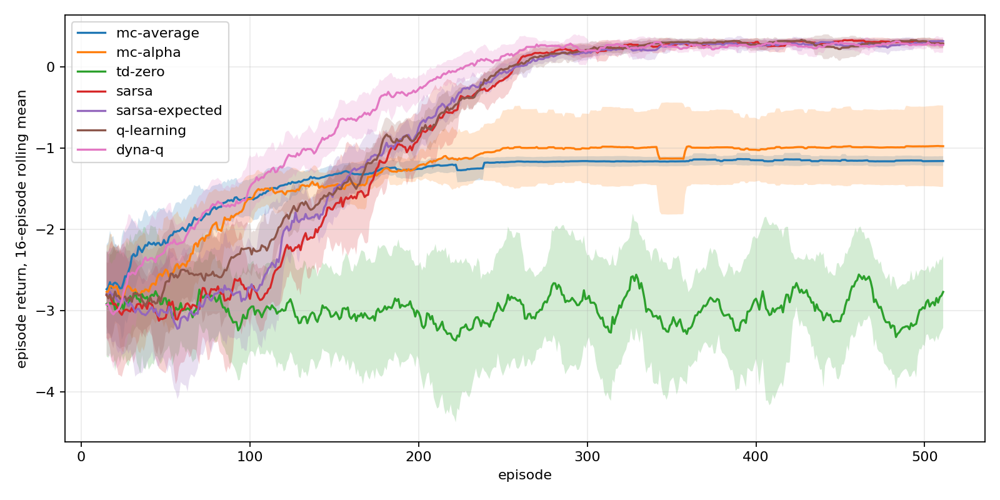
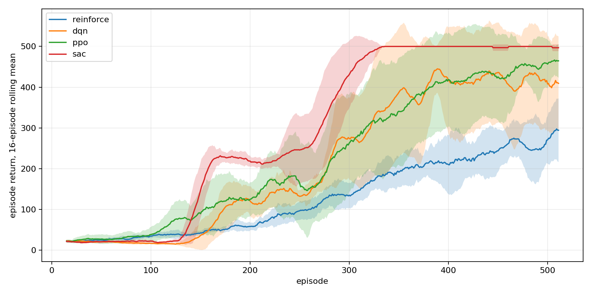
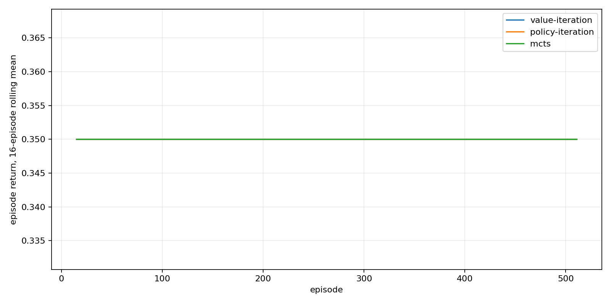

# RL Zero to Hero

## Structure

| Track | Description |
| --- | --- |
| `tabular/` | Classic discrete-state RL on GridWorld |
| `deep/` | Neural RL for environments like CartPole |
| `planning/` | Model-based planning on GridWorld |

## Learning Methods

| Path | Summary |
| --- | --- |
| `tabular/agents/mc-average` | First-visit / every-visit Monte Carlo with running averages |
| `tabular/agents/mc-alpha` | Monte Carlo control with constant learning rate |
| `tabular/agents/td-zero` | State-value TD(0) prediction |
| `tabular/agents/sarsa` | On-policy TD control with delayed bootstrap |
| `tabular/agents/sarsa-expected` | Expected SARSA with epsilon-greedy expectation |
| `tabular/agents/q-learning` | Off-policy TD control with greedy bootstrap |
| `tabular/agents/dyna-q` | Model-based Dyna-Q with planning steps |
| `deep/agents/reinforce` | Monte Carlo policy gradient |
| `deep/agents/dqn` | Replay-buffer DQN |
| `deep/agents/ppo` | Clipped actor-critic policy gradient |
| `deep/agents/sac` | Discrete soft actor-critic |
| `planning/agents/vi` | Dynamic programming value iteration |
| `planning/agents/pi` | Dynamic programming policy iteration |
| `planning/agents/mcts` | Monte Carlo tree search |

## CLI

```bash
uv run tabular/cli.py render --size 8 --env-seed 24
uv run tabular/cli.py train --algorithm q-learning --env-seed 24 --agent-seed 24 --train-episodes 512 --show-policy --plot tabular/plot/q_learning.png
uv run tabular/cli.py benchmark --seed 24 --runs 8 --train-episodes 512 --eval-episodes 32 --plot tabular/plot/benchmark.png
uv run deep/cli.py train --algorithm ppo --env-seed 24 --agent-seed 24 --train-episodes 512 --plot deep/plot/ppo.png
uv run deep/cli.py benchmark --seed 24 --runs 8 --train-episodes 512 --eval-episodes 32 --plot deep/plot/benchmark.png
uv run planning/cli.py train --algorithm mcts --env-seed 24 --agent-seed 24 --train-episodes 512 --plot planning/plot/mcts.png
uv run planning/cli.py benchmark --seed 24 --runs 8 --eval-episodes 32 --plot planning/plot/benchmark.png
```

## Learning Curves

### Tabular



### Deep



### Planning



## Test

```bash
uv run pytest
```
